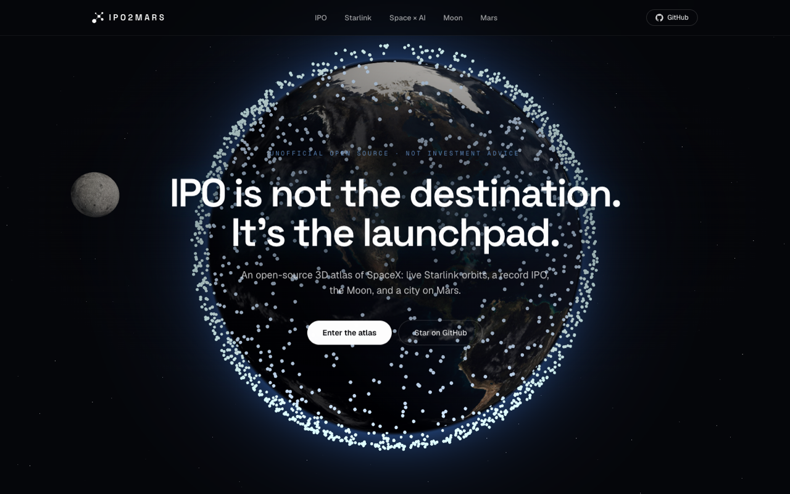

# ipo2mars

**IPO is not the destination. It's the launchpad.**

An open-source, interactive 3D atlas of SpaceX — from reusable rockets and the **live Starlink constellation** to a record-breaking IPO, orbital AI, and a self-sustaining city on Mars.

> ⚠️ **Unofficial fan project.** Not affiliated with, endorsed by, or sponsored by SpaceX, Starlink, xAI, Tesla, or Elon Musk. Nothing here is investment advice. All figures cite public reporting.



**Live:** https://ipo2mars.com · **Built in public** for the SpaceX (SPCX) listing.

---

## What's inside

- 🌍 **Live Starlink hero** — a textured Earth wrapped in the real Starlink constellation. Every dot is an actual satellite, placed from public [CelesTrak](https://celestrak.org) orbital data and propagated in your browser with SGP4.
- 🚀 **IPO Mission Control** — a live countdown to the Nasdaq open, the $1.77T valuation, the $75B raise, and the demand-vs-raise oversubscription, every figure sourced and dated.
- 🛰️ **The Starlink mesh** — what the constellation is, and why it's the revenue engine under the IPO story.
- 🤖 **Space × AI** — what the SpaceX × xAI merger really means today, and what's still speculative (clearly labeled).
- 🌕 **The Moon, first** — where Starship HLS fits in the Artemis return: the docking demo, the first crewed landing targeted for Artemis IV, and why every lunar milestone is a dress rehearsal for Mars. (The hero scene has a slowly orbiting Moon, too.)
- 🔴 **Mars** — transfer windows, Starship cadence, and the arc toward a city of a million people. Includes the interactive settlement simulator: set the fleet, see when a city of a million becomes self-sustaining.

## How it works

One Cloudflare Worker, two cleanly separated rendering paths:

- **Hono JSX SSR** renders every page as real server HTML — full text content, per-page JSON-LD, OpenGraph, `llms.txt`, `robots.txt`, `sitemap.xml`. Great for search and AI engines; the 3D is pure progressive enhancement.
- **A React + React Three Fiber island** (bundled separately by esbuild → `public/assets/scene.js`) mounts the WebGL Earth/constellation as a fixed backdrop on the home page only. Content pages get a lightweight CSS starfield instead — no 1MB bundle on your SEO pages.
- The worker **proxies and caches the CelesTrak TLE feed in KV** (with a cron warmer), so the browser fetches same-origin and CelesTrak is never hammered.

```
Browser ──/──▶ Hono Worker (SSR HTML) ──▶ #scene <div>
                     │                          ▲
                     └─/api/tle/starlink─▶ KV ──┘  scene.js (React/R3F) propagates
                                  │                 satellites with satellite.js
                              CelesTrak (cron-warmed)
```

## Tech stack

[Cloudflare Workers](https://workers.cloudflare.com) · [Hono](https://hono.dev) (`hono/jsx` SSR) · [React 19](https://react.dev) · [React Three Fiber](https://r3f.docs.pmnd.rs) + [drei](https://github.com/pmndrs/drei) + postprocessing · [three.js](https://threejs.org) · [satellite.js](https://github.com/shashwatak/satellite-js) · [Tailwind CSS](https://tailwindcss.com) · esbuild

## Run locally

```bash
npm install
npm run dev          # wrangler dev → http://localhost:8787
# in a second terminal, for live rebuilds while you edit:
npm run dev:client   # rebuild the R3F island on change
npm run dev:css      # rebuild Tailwind on change
```

`npm run build` produces `public/styles.css` + `public/assets/*.js`. `npm run typecheck` checks both the worker (`hono/jsx`) and the client (`react`) projects.

## Project structure

```
src/
  index.tsx          Hono worker: routes, SSR, /api, cron warmer
  pages/             Hono JSX SSR pages (Home, SpacexIpo, Starlink, SpacexAi, Moon, Mars)
  components/        Layout, Footer, Article (shared SSR UI)
  lib/               tle.ts (CelesTrak + KV), seo.ts (JSON-LD)
  data/              site.ts, ipo.ts (facts with source + lastVerified)
  routes/api.ts      /api/tle/starlink
  client/            React + R3F island (built separately by esbuild)
    scene/           Earth, Starlink, Moon, Atmosphere, Experience
    countdown.ts     tiny vanilla countdown
public/textures/     NASA-derived Earth maps (public domain)
```

## Data sources & credits

- **Orbital data:** [CelesTrak](https://celestrak.org) Starlink GP/TLE feed (public).
- **Earth & Moon textures:** NASA-derived imagery (public domain), via the three.js examples.
- **IPO figures:** public reporting (CNBC and others), each carrying a `source` + `lastVerified` in [`src/data/ipo.ts`](src/data/ipo.ts).

## Contributing

This is built in public and contributions are very welcome — especially:

- 🔴 **Extending the settlement simulator** (attrition, cargo splits, Monte Carlo on `src/lib/marsModel.ts`).
- 🌐 **Internationalization** of the SSR pages.
- ⚡ **Perf** — move SGP4 propagation into a Web Worker; trim the R3F bundle.
- 🛰️ **Starlink coverage/latency modes** on a dedicated 3D view.

See [CONTRIBUTING.md](CONTRIBUTING.md). Good first issues are tagged in the tracker.

## Disclaimer

ipo2mars is an unofficial, open-source visualization project for educational and commentary purposes. It is **not affiliated with, endorsed by, or sponsored by** SpaceX, Starlink, xAI, Tesla, or Elon Musk, and uses no official logos. Nothing on the site is **investment advice**. Trademarks belong to their respective owners.

## License

Code: [MIT](LICENSE). Content & visualizations: CC BY 4.0.
